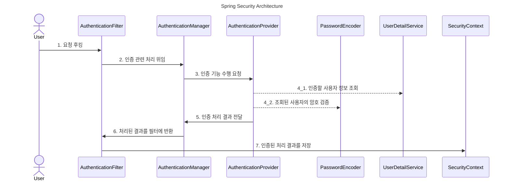

> 스프링 시큐리티 개요

# 기본 구성
Spring Security 인증 처리 간 기본 구성

## AuthenticationFilter
인증 필터로써, 정해진 엔드포인트를 통해 들어온 요청들을 본 비즈니스 로직 호출 전에 취득하여 인증 절차를 진행하도록 돕는다.

## AuthenticationManager
인증 필터에서 걸러진 요청에 대해 인증 처리 절차에 대한 요청 처리를 담당한다.
- *해당 객체에서 `AuthenticationProvider`에게 인증 진행 간 각종 실제 처리를 요청함*

## AuthenticationProvider
전달받은 인증 요청 데이터에 대해 사용자 세부 데이터 조회 및 암호 검증 등의 세부 작업을 처리한다.
- 미리 bean으로 지정된 `PasswordEncoder`를 통해 암호 검증 진행
- 미리 bean으로 지정된 `UserDetailService`를 통해 사용자 세부 정보 조회

## UserDetailService
요청 데이터를 기반으로 사용자 세부 정보 조회를 통해 요청자의 정보를 확인하여 반환한다.
- 실제 구현 시에는 해당 인터페이스를 기반으로 비즈니스 요소에 맞게 재구성 하여 사용함
- Spring Security의 기본 구현체는 InMemory에 구동 시점에 저장된 User 정보를 조회함

## PasswordEncoder
조회된 사용자의 암호에 대한 검증 작업을 수행한다.
- `UserDetailService` 구현에 맞게 재구성하여 사용함
- 또한 초기 저장 시에 암호 필드에 대한 인코딩도 수행함
	- *Spring Boot의 기본 구현체는 별도의 암호화를 하지 않음*
