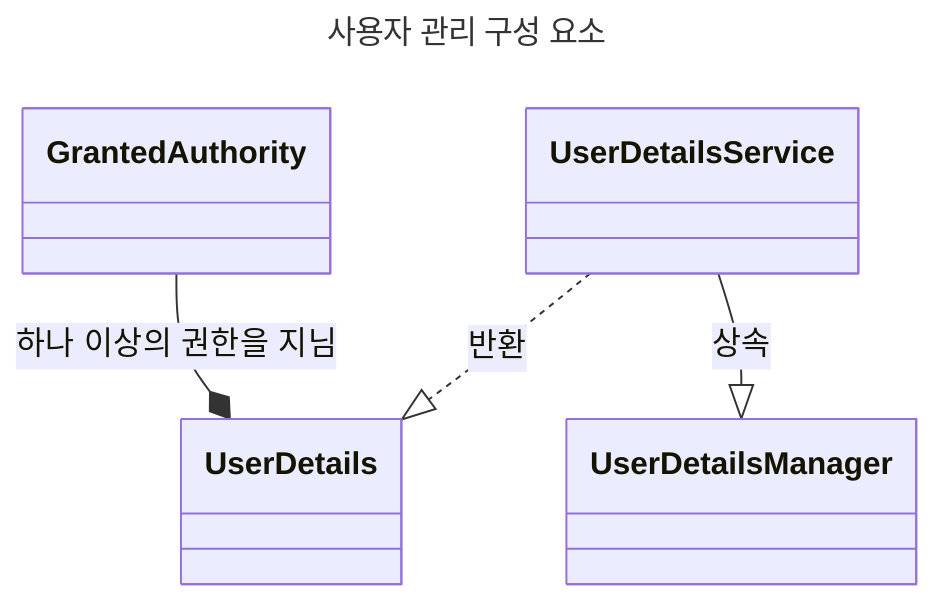

> 사용자 관리

# UserDetailsService와 UserDetailsManager
Spirng Security에서는 사용자 관리를 위한 요소로써 `UserDetailsService`와 `UserDetailsManager`인터페이스를 제공한다.

`UserDetailsService`는 오로지 사용자 이름에 대한 검색 역할만 담당하며, `UserDetailsManager`는 사용자 추가, 수정, 삭제 등을 담당한다.
- *이와 같이 명확하게 역할이 분리되어 있기에 개발자 입장에서는 유연성이 확장되게 됨*

# 사용자 관리 구성 요소


## UserDetails
Spring Security에서 나타내는 사용자 인터페이스, 기본적으로 사용자명과 사용자가 수행할 수 있는 권한 집합을 지녔다.
```java
public interface UserDetails extends Serializable {  
    Collection<? extends GrantedAuthority> getAuthorities();  
  
    String getPassword();  
  
    String getUsername();  
  
    boolean isAccountNonExpired();  
  
    boolean isAccountNonLocked();  
  
    boolean isCredentialsNonExpired();  
  
    boolean isEnabled();  
}
```

위와 같이 인증 작업에 필요한 getUsername(), getPassword() 뿐만 아니랑 계정 만료, 활성화 등 권한 설정과 관련된 메소드들이 정의되어 있으며, 사용자별 권한 집합을 뜻하는 getAuthorities() 메소드가 정의되어 있다.

## UserDetailsService
Spring Security에서 사용자 이름을 통해 `UserDetails`를 조회하는 기능에 대한 인터페이스다.
- 해당 인터페이스를 상황 및 비즈니스에 맞게 구현하여 사용함

```java
public interface UserDetailsService {  
    UserDetails loadUserByUsername(String username) throws UsernameNotFoundException;  
}
```

위와 같이 입력된 사용자명에 해당하는 `UserDetails`를 반환하도록 메소드가 정의되어 있다.
### UserDetailsManager
`UserDetailsService`의 확장 인터페이스로, 단순 조회 뿐 아니라, 추가, 수정, 삭제 등을 지원하는 인터페이스다.
- *`InmemoryDetailsManager`등이 이에 대한 기본 구현체임*

```java
public interface UserDetailsManager extends UserDetailsService {  
    void createUser(UserDetails user);  
  
    void updateUser(UserDetails user);  
  
    void deleteUser(String username);  
  
    void changePassword(String oldPassword, String newPassword);  
  
    boolean userExists(String username);  
}
```

위와 같이 사용자 생성, 수정, 삭제 등과 관련된 메소드들이 정의되어 있다.
## GrantedAuthority
`UserDetils`가 지닌 권한에 대한 인터페이스이다.
```java
public interface GrantedAuthority extends Serializable {  
    String getAuthority();  
}
```

위와 같이 문자열 형태의 권한 정보를 반환하는 메소드 정의로 이루어져 있다.