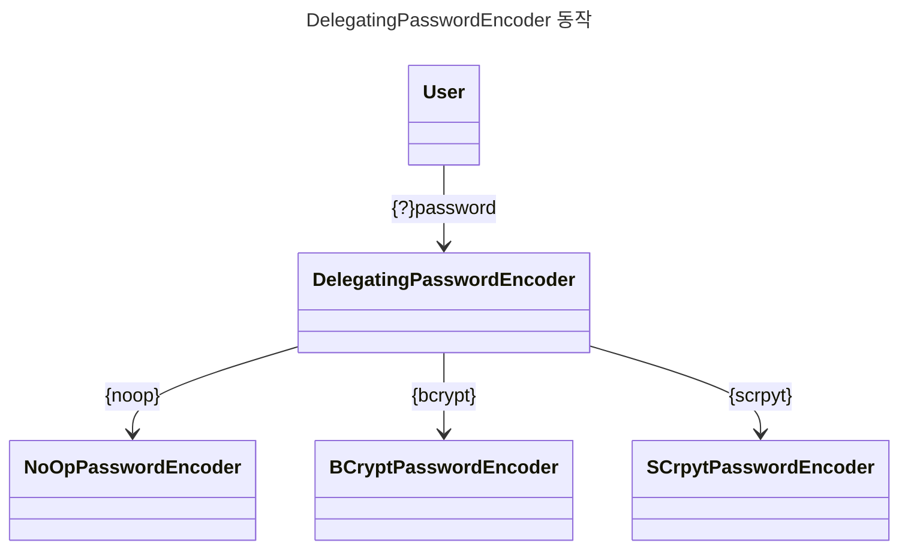

> Spring Security 인증 처리 간 암호 관리

# PasswordEncoder
Spring Security에서는 `AuthenticationProvider` 가 사용자 관리와 함께 조회된 사용자에 대한 암호 관리를 위해 `PasswordEncoder`라는 별도 인터페이스에 관련 기능을 위임한다.

```java
public interface PasswordEncoder {  
    String encode(CharSequence rawPassword);  
  
    boolean matches(CharSequence rawPassword, String encodedPassword);  
  
    default boolean upgradeEncoding(String encodedPassword) {  
        return false;  
    }  
}
```

위와 같이 `PasswordEncoder` 인터페이스는 암호에 대한 인코딩과 주어진 암호값에 대한 검증 기능을 정의한다.
- *upgradeEncoding() 이 true일 경우 인코딩된 암호를 한 번 더 인코딩함.*

## Spring Security에서 제공하는 구현체
### NoOpPasswordEncoder
주어지는 암호에 대한 일체의 인코딩을 진행하지 않는 구현체로, 일반 운영 환경에서는 절대 쓰여선 안된다.
```java
public PasswordEncoder passwordEncoder() {  
    return NoOpPasswordEncoder.getInstance();  
}
```

NoOpPassswordEncoder의 경우 singletion 형태이기에 getInstance()를 통해 인스턴스를 조회하여 사용할 수 있다.
### StandardPasswordEncoder
 SHA-256 해싱 알고리즘을 통해 인코딩 및 matched() 를 구현한 구현체
 - 현재 기준 구식 구현체이기에 사용을 자제하는 것이 좋음
```java
public PasswordEncoder passwordEncoder() {  
    String secret = "secret-key";  
    return new StandardPasswordEncoder(secret);  
}
```

위와 같이 Secret Key 를 인자로 주입하여 초기화할 수 있다.
- *인자가 없을 경우 빈 문자열을 SecretKey로 함*
### Pbkdf2PasswordEncoder
PBKDF2 를 이용한 구현체
```java
public PasswordEncoder passwordEncoder() {  
    String secret = "test";  
    return new Pbkdf2PasswordEncoder(secret, 18500, 256, PBKDF2WithHmacSHA256);  
}
```

위와 같이 구성하여 사용하며 PBKDF2 의 경우 주어진 반복횟수만큼 **HMAC**을 수행하는 단순 해싱 함수이기에 반복 횟수와 해시의 크기를 인자로 하며, 추가적으로 해싱 알고리즘도 인자로 주어 초기화 한다.

>[!NOTE]
>**HMAC 이란?**
>
>해싱 함수를 이용하여 인증 코드를 생성하는 요소로써 실제 값이 변할 경우 해시도 변하는 해싱 함수의 특징을 활용한다.


### BCryptPasswordEncoder
bcrypt 해싱 함수로 인코딩을 제공하는 구현체
```java
PasswordEncoder passwordEncoder = new BCryptPasswordEncoder();  
PasswordEncoder passwordEncoder1 = new BCryptPasswordEncoder(4);  

SecureRandom secureRandom = SecureRandom.getInstanceStrong();  
PasswordEncoder passwordEncoder2 = new BCryptPasswordEncoder(4, secureRandom);
```

`BCryptPasswordEncoder`의 경우 기본 생성자를 통해 초기화 하거나 strength를 주어 강도 계수를 조절하거나,  SecureRandom 인스턴스를 지정된걸로 구성하도록 인자를 주입할 수 있다.
### SCryptPasswordEncoder
scrypt 해싱 함수로 인코딩을 제공하는 구현
```java
public PasswordEncoder passwordEncoder() {  
    int cpuCost = 16384;  
    int memoryCost = 8;  
    int parallelization = 1;  
    int keyLength = 32;  
    int saltLength = 64;  
  
    return new SCryptPasswordEncoder(cpuCost, memoryCost, parallelization, keyLength, saltLength);  
}
```

`SCryptPasswordEncoder`는 CPU 비용, Memory 비용, 병렬 처리 계수, 키 길이, 솔트 길이 로 이루어진 인자를 주입 받아 초기화한다.

## DelegatingPasswordEncoder
애플리케이션 개발 및 유지 보수 간 한 종류의 `PasswordEncoder` 뿐 아니라 2개 이상의 `PasswordEncoder`를 사용해야 할 경우, 암호의 인코딩 종류 별로 암호 관리를 할 수 있어야 한다.

이 때 `DelegatingPasswordEncoder`가 이러한 상황에서 관련 기능을 제공하며, 사전 정의된 접두사에 따라 암호 확인을 각 종류 별 `PasswordEncoder`에 위임한다.

### 사전 정의된 접두사
| 접두사      | 위임 구현체                |
| -------- | --------------------- |
| {noop}   | NoOpPasswordEncoder   |
| {bcrypt} | BCryptPasswordEncoder |
| {scrypt} | SCryptPasswordEncoder |


### DelegatingPasswordEncoder 선언
```java
@Bean  
public PasswordEncoder passwordEncoder() {  
    Map<String, PasswordEncoder> encoderMap = Map.of(  
       "noop", NoOpPasswordEncoder.getInstance(),  
       "bcrpyt", new BCryptPasswordEncoder(),  
       "scrypt", SCryptPasswordEncoder.defaultsForSpringSecurity_v5_8()  
    );  
  
    return new DelegatingPasswordEncoder("noop", encoderMap);  
}
```

위와 같이 각 접두사에 대한 key와 그에 대한 `PasswordEncoder` 구현체를 등록한 Map 과 기본으로 사용할 key를 인자로 하여 `DelegatingPasswordEncoder`를 초기화 할 수 있다.

또는 아래와 같이 Spring Security가 제공하는 `PasswordEncoderFactories`의 정적 메소드로도 구성할 수 있다.

```java
// BCryptPasswordEncoder가 기본값인 DelegatingPasswordEncoder
PasswordEncoderFactories.createDelegatingPasswordEncoder();
```


# SSCM : Spring Security Crypto Modules
Spring Security에서는 암복호화 관련 기능 수행을 위한 각종 유틸리티 객체를 지원한다.
## 키 생성기
특정 형식의 키를 생성할 수 있도록 하는 여러 인터페이스와 그러한 인터페이스를 초기화할 수 있는 팩토리 클래스를 제공한다.

```java
// 문자열 키 생성기
StringKeyGenerator stringKeyGenerator = KeyGenerators.string();  
String sault = stringKeyGenerator.generateKey();  

// 바이트 배열 키 생성기
BytesKeyGenerator bytesKeyGenerator = KeyGenerators.secureRandom();  
byte[] keys = bytesKeyGenerator.generateKey();  
int length = bytesKeyGenerator.getKeyLength();
```

## 암호기
문자열 혹은 바이트 배열에 대한 인코딩/디코딩을 지원하는 인터페이스들과 그러한 인터페이스들을 초기화할 수 있는 팩토리 클래스를 제공한다.

### 바이트 암호기
```java
String salt = KeyGenerators.string().generateKey();  
String secret = "secret";  
byte[] bytes = "test".getBytes(StandardCharsets.UTF_8);  
  
BytesEncryptor bytesEncryptor = Encryptors.standard(secret, salt); // 바이트 암호기 생성
byte[] encrypted = bytesEncryptor.encrypt(bytes);  // 바이트 암호화
byte[] decrypted = bytesEncryptor.decrypt(bytes);  // 바이트 복호화

BytesEncryptor strongEncorder = Encryptors.stronger(secret, salt); // 더 강력한 암호기기

```

### 문자열 암호기

```java
String salt = KeyGenerators.string().generateKey();  
String secret = "secret";  
  
String plainText = "test";  
  
TextEncryptor noOpText = Encryptors.noOpText();  // 암복호화를 안하는 문자열 암호기 생성
TextEncryptor textEncryptor = Encryptors.text(secret, salt); // 기본 문자열 암호기 생성
TextEncryptor strongEncryptor = Encryptors.delux(secret, salt); // 보다 강력한 문자열 암호기 생성
  
String encoded = textEncryptor.encrypt(plainText);  
String decoded = textEncryptor.decrypt(plainText);
```
