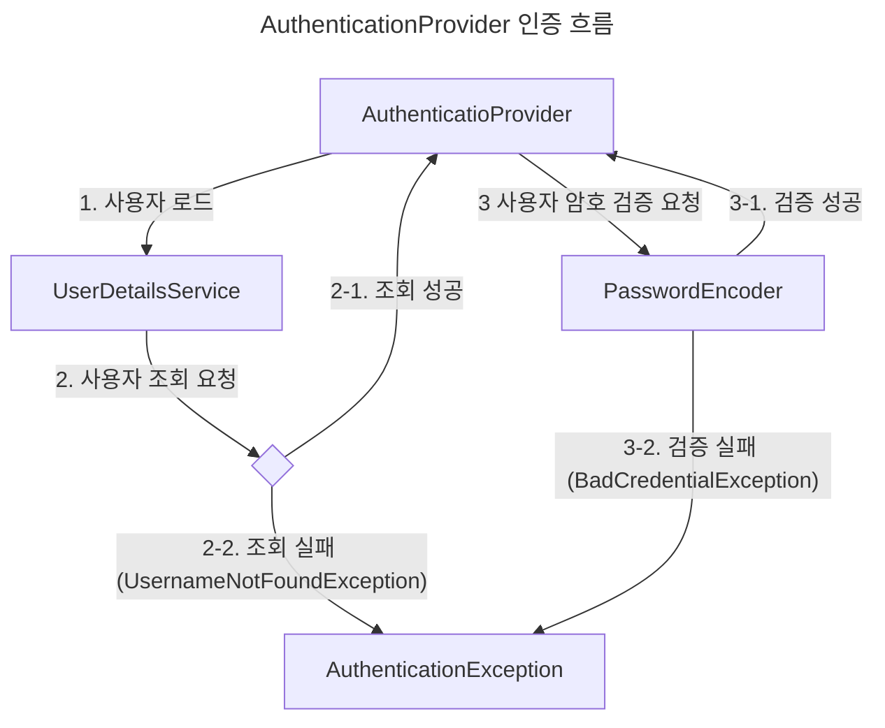

> Spring Security 인증 구현

# Authentication
Spring Security에서 인증 작업 간 필수적으로 필요한 인증 관련 이벤트에 대한 내용을 위한 인터페이스 객체이다.

`A=uthentication`은 내부적으로 Java 의 security api 객체 중 하나인 `Principal`을 확장해서 사용한다.
- `Principal`은 인증 주체를 뜻하며, 인증 요청을 시도한 사용자에 대한 정보를 뜻하며, 최소한 해당 사용자의 이름을 반환하도록 정의한다.

## Authentication 정의

```java
public interface Authentication extends Principal, Serializable {  
    Collection<? extends GrantedAuthority> getAuthorities();  // 인가된 권한 반환
  
    Object getCredentials(); // 인증 작업 간 암호나 민감 데이터 반환
  
    Object getDetails();  // 인증 상세 정보 반환
  
    Object getPrincipal();  // 인증 주체 반환
  
    boolean isAuthenticated();  // 인증 작업이 완료되었는지 여부 반환
  
    void setAuthenticated(boolean isAuthenticated) throws IllegalArgumentException;  
}
```

# AuthenticationProvider
Spring Security에서 `AuthenticationManger`가 인증 관련 요청을 위임하는 인터페이스 객체로, 인증 수행중인 `Authentication` 객체를 입력 받아, 유효한 인증 정보인지 등을 확인 후 최종적으로 authenticated 된 `Authentication` 객체를 반환하도록 정의한다.

```java
public interface AuthenticationProvider {  
    Authentication authenticate(Authentication authentication) throws AuthenticationException;  
  
    boolean supports(Class<?> authentication);  
}
```

`authenticate()` 메소드 정의를 통해 인증된 `authentication`을 반환하도록 정의하고 있으며, `supports()` 메소드 정의를 통해 현재 요청들어온 인증 객체가 작업을 수행할 수 있는 인증 객체인지 여부 등을 정의할 수 있다.

> [!NOTE]
> **supprts() 를 통한 유연성 확보**
> 
> `AuthenticationProvider`에서는 주어진 `authentication`이 유효한지 여부를 `supports()`를 통해 정의할 수 있으며, 뿐만 아니라 유효한 객체더라도 인증 과정에서 확인할 수 없는 요소인 경우 null을 반환하여, 유효한 형태의 객체지만 알 수 없는 요소란 점을 반환 할 수 있다.

## AuthenticationProvider 인증 흐름


# SecurityContext
인증이 완료된 `Authentication` 객체에 대해 인증 작업 이후, 엔드포인트 메소드 수행 부분에서 인증된 사용자에 대한 정보가 필요한 경우가 존재한다. 이런 경우 인증된 객체 정보를 사용하기 위해 Spring Security에서는 이와 관련하여 `Authentication` 객체 저장 및 조회 등이 정의된 `SecurityContext` 인터페이스를 제공한다.

```java
public interface SecurityContext extends Serializable {  
    Authentication getAuthentication();  
  
    void setAuthentication(Authentication authentication);  
}
```

## SecuriyContext Strategy
엔드포인트 메소드 시점에 `SecurityContext`를 통해 `Authentication`을 조회하기 위해 크게 세 종류의 전략으로 `SecurityContext`를 관리 할 수 있다/

### MODE_THREADLOCAL
각 Thread 별 별도의 `SecurityContext`를 괸라하는 전략으로,  일반적인 동기 애플리케이션의 경우 각 요청 마다 Thread를 생성하기에 일반적으로 많이 사용되는 전략이다.
- *SecurityContextHolder의 기본 설정*

### MODE_INHERITABLETHREADLOCAL
`MODE_THREADLOCAL`과 비슷하게 각 Thread 별로 `SecurityContext`를 관리하나, 비동기 요청 처리의 경우 해당 요청을 위해 별도의 Thread가 생성될 때 기존 요청 Thread 내 `SecurityContext`를 복사하여 사용하도록 하는 전략이다.

> [!NOTE]
> 단, 이는 Spring에서 생성하여 관리하는 Thread에 한해서만 지원하며, Spring과 별개로 Thread를 생성하여 사용할 경우에는 명시적으로 SecurityContext를 복제하여 넘겨주어야 한다.

### MODE_GLOBAL
애플리케이션에서 관리되는 모든 Thread 가 동일한 `SecurityContext`를 사용하도록 하는 전략이다.

## SecurityContext 조회
인증 작업 이후 엔드포인트 메소드에서는 `SecurityContext` 및 내부에 저장된 `Authentication`객체를 곧바로 조회할 수 있다.

```java
@GetMapping("/me")  
public String me() {  
    SecurityContext securityContext = SecurityContextHolder.getContext();  
    Authentication authentication = securityContext.getAuthentication();  
  
    return (String)authentication.getPrincipal();  
}
```


위와 같이 Spring에서 구성한 `SecurityContextHolder`에서 현재 `SecurityContext` 를 참조하여 `Authentication` 객체를 가져올 수 있다.

```java
@GetMapping("/me")  
public String me(Authentication authentication) {  
  
    return (String)authentication.getPrincipal();  
}
```

뿐만 아니라 Spring에서는 인증 작업 이후 `Authenntication` 객체를 엔드포인트 메소드의 인자로 줄 수 있기에 위와 같이 인자로 받아와 사용할 수 도 있다.

## 자체 관리 Thread에서의 SecurityContext 전파
Spring에서 생성하는 Thread의 경우 `SecurityContextHolderStrategy`를 `MODE_INHERITABLETHREADLOCAL` 로 지정할 경우 자동으로 신규 Thread에 복제하여 사용할 수 있으나, 자체적으로 생성하는 Thread에 대해서는 이러한 과정을 명시적으로 전파해야 한다.

이를 위해 Spring Security에서는 `Callable<T>`과 `Runnable`을 확장한 `DelegatingSecurityContextCallable`과 `DelegatingSecurityContextRunnable` 을 지원한다.

뿐만 아니라 Thread 레벨이 아닌 해당 Thread를 실행하는 `ExecutorService`를 확장한 `DelegatingSecurityContextExecutorService`도 제공한다.

### DelegatingSecurityContextRunnable
반환 값이 필요 없는 Thread 구성 시에 `SecurityContext` 정보 조회가 필요한 경우 아래와 같이  `DelegatingSecurityContextRunnable`을 초기화하여 `SecurityContext`를 복제하여 사용할 수 있도록 한다.

```java
@GetMapping("/run")  
public void run() {  
    log.info("Run : {}", Thread.currentThread().getName());  
  
    Runnable task = new AuthenticateRunner();  
  
    ExecutorService executorService = Executors.newCachedThreadPool();  
  
    DelegatingSecurityContextRunnable runner = new DelegatingSecurityContextRunnable(task);  
  
    executorService.execute(runner);  
  
}
```

### DelegatingSecurityContextCallable
반환 값이 필요한 Thread 구성 시에  `SecurityContext` 정보 조회가 필요한 경우 아래와 같이 `DelegatingSecurityContextCallable`을 초기화하여 `SecurityContezt`를 복제하여 사용할 수 있다.

```java
@GetMapping("/call")  
public String call() throws ExecutionException, InterruptedException {  
    log.info("Call : {}", Thread.currentThread().getName());  
  
    Callable<String> task = new AuthenticationCaller();  
  
    ExecutorService executorService = Executors.newCachedThreadPool();  
  
    DelegatingSecurityContextCallable<String> caller = new DelegatingSecurityContextCallable<>(task);  
  
    return executorService.submit(caller).get();  
}
```

### DelegatingSecurityContextExecutorService
Thread를 수행하는 주체인 `ExectorService` 인터페이스를 확장한 `DelegatingSecurityContetExecutorServce`를 통해 해당 `ExecutorService` 를 통해 실행되는 Thread에게 `SecurityContext`를 주입하여 각 Thread가 상위 Thread의  `SecurityContext`를 사용할 수 있게 해준다.

```java
@GetMapping("/run")  
public void run() {  
    log.info("Run : {}", Thread.currentThread().getName());  
  
    Runnable task = new AuthenticateRunner();  
  
    ExecutorService executorService = Executors.newCachedThreadPool();  

	// ExecutorService를 인자로 주어 DelegatingSecurityContextExecutorService 로 래핑한다.
    executorService = new DelegatingSecurityContextExecutorService(executorService);  
  
    executorService.execute(task);  
  
}
```

# Spring Security 인증 결과 후처리
Spring Security에서는 인증 작업 이후 인증 결과에 따라 성공 시 수행할 로직을 구성할 수 있는 `AuthenticationSuccessHandler`와 실패 시 수행 로직을 구성할 수 있는 `AuthenticationFailureHandler` 인터페이스를 제공하며, 실패에 따른 응답 결과를 재구성할 수 있도록 `AUthenticatioNEntryPoint` 인터페이스를 제공한다.

## AuthenticationEntryPoint
Spring Security의 인증 필터 수행 간 인증 실패로 인해 `AuthenticationException` 및 인가 실패로 인한 `AccessDeniedException`이 발생하고 이를 이후 `ExceptionTranslationManager` 객체에서 예외에 대한 응답 처리를 위해 `AuthenticationEntryPoint`인터페이스를 거치게 된다.

```java
public interface AuthenticationEntryPoint {  
    void commence(HttpServletRequest request, HttpServletResponse response, AuthenticationException authException) throws IOException, ServletException;  
}
```

그렇기에 인증 실패 작업에 대해 그에 따른 별도 응답을 반환하거나 재구성해야 할 경우 `AuthenticationEntryPoint`를 재정의하여 사용하면 된다.

## AuthenticationSuccessHandler
인증 성공 시 이후 작업을 수행할 기능을 별도 재정의하기 위한 인터페이스로 아래와 같이 재정의하여 인증 작업 이후 기능 동작을 지정할 수 있다.

```java
public class CustomSuccessHandler implements AuthenticationSuccessHandler {  
    @Override  
    public void onAuthenticationSuccess(HttpServletRequest request, HttpServletResponse response, Authentication authentication) throws  
       IOException,  
       ServletException {  
       log.info("Successes Authentication, username = {}", authentication.getPrincipal());  
       response.sendRedirect("/");  
    }  
}
```

## AuthenticationFailureHandler
인증 실패 시 이후 작업을 수행할 기능을 별도 재정의하기 위한 인터페이스로 아래와 같이 재정의하여 인증 작업 이후 기능 동작을 지정할 수 있다.

```java
public class CustomFailureHandler implements AuthenticationFailureHandler {  
    @Override  
    public void onAuthenticationFailure(HttpServletRequest request, HttpServletResponse response, AuthenticationException exception) throws  
       IOException,  
       ServletException {  
  
       log.error("Faild Authentication, error = {}", exception.getMessage());  
  
       response.sendRedirect("/error");  
    }  
}
```