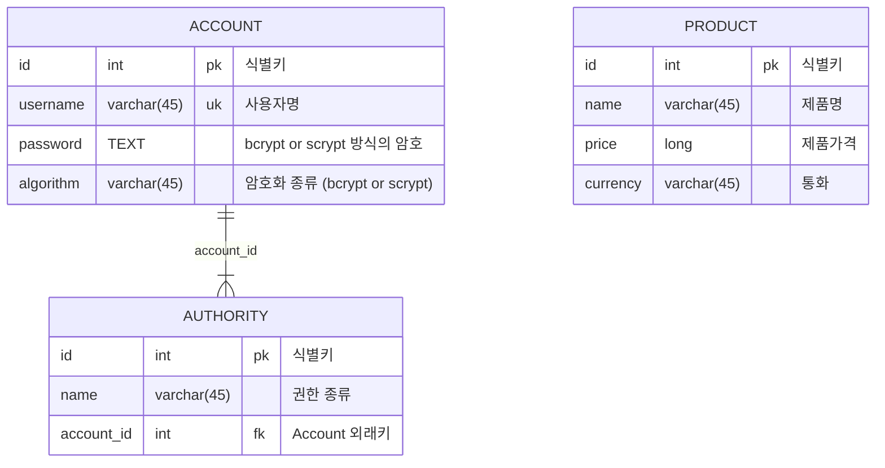

> Spring Security를 활용한 실사용 App 구현

# 요구 사항
DB에 적재된 사용자 정보를 조회하여 제품을 보여줄 수 있는 페이지 제공
- DB에는 제품 정보와 사용자 정보 및 권한 정보로 구성됨
- 사용자 암호는 brcrypt와 scrypt가 모두 사용

# ERD

```mermaid
erDiagram

ACCOUNT {
	id int pk "식별키"
	username varchar(45) uk "사용자명"
	password TEXT "bcrypt or scrypt 방식의 암호"
	algorithm varchar(45) "암호화 종류 (bcrypt or scrypt)"
}

AUTHORITY {
	id int pk "식별키"
	name varchar(45) "권한 종류"
	account_id int fk "Account 외래키"
}

PRODUCT {
	id int pk "식별키"
	name varchar(45) "제품명"
	price long "제품가격"
	currency varchar(45) "통화"
}

ACCOUNT ||--|{ AUTHORITY : account_id
```

