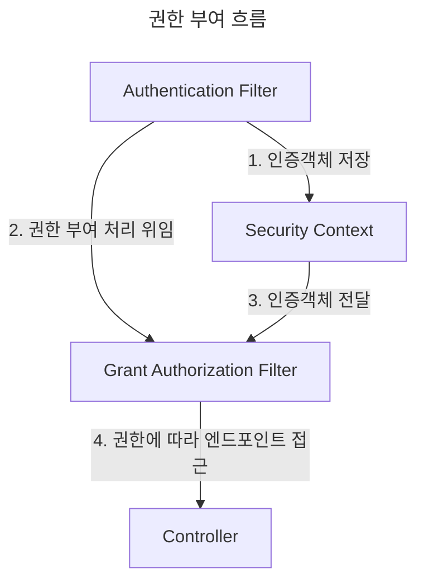

> 권한 부여 구성 : Access 제한

# Authorization
`Authorization`이란 인증된 사용자가 요청 리소스에 접근할 수 있는지 여부에 대한 권한 확인 및 처리 프로세스를 뜻한다.

Spring Security에서는 인증 작업 이후 요청을 권한 부여 필터에 위임한다.

## 권한 부여 흐름


## GrantedAuthority
Spring Security 에서 제공하는 `UserDetails`의 권한 관련 인터페이스로 아래와 같이 이루어져 있다.

```java
public interface GrantedAuthority extends Serializable {  
    String getAuthority();  
}
```

`getAuthority()` 메소드를 통해 String 타입으로 반환받는 권한 규칙에 따라 프로세스를 진행할 수 있다.
- *`UserDetails` (사용자)는 하나 이상의 authority를 지닐 수 있음*

# 엔드포인트 별 권한 부여
Spring Security에는 크게 `hasAuthoirty()`, `hasAnyAuthoirty()`, `access()` 메소드를 통해 요청 엔드포인트 별 인가 권한을 별도 지정할 수 있다.

## hasAuthority()
인자에 해당하는 authority를 지닌 사용자만 접근할 수 있다.

```java
@Bean  
public SecurityFilterChain securityFilterChain(HttpSecurity http) throws Exception {  
    http.authorizeHttpRequests(registry -> {  
                registry.requestMatchers(PathRequest.toH2Console()).permitAll()  
                        .requestMatchers(HttpMethod.POST, "/auth/**")  
                        .hasAuthority("WRITE")  
                        .anyRequest().authenticated();  
            }) 
            ... 
    return http.build();  
}
```

위와 같이 HTTP 메소드 및 URL 패턴 별로 권한을 지정할 수 있다.
- *위의 경우 POST : /auth 하위 엔드포인트들은 WRITE 권한 필요*

## hasAnyAuthority()
인자에 해당하는 authoirty들 중 **하나 이상을** 지닌 사용자만 접근할 수 있다.

```java
@Bean  
public SecurityFilterChain securityFilterChain(HttpSecurity http) throws Exception {  
    http.authorizeHttpRequests(registry -> {  
                registry.requestMatchers(PathRequest.toH2Console()).permitAll()  
                        .requestMatchers(HttpMethod.GET, "/auth/**")  
                        .hasAnyAuthority("READ", "WRITE")
                        .anyRequest().authenticated();  
            })
            ...
    return http.build();  
}
```

*위의 경우 GET : /auth 하위 엔드포인트들은, WRITE나 READ 권한 필요*

## access()
~~인자로 Spring 에서 적용가능한 형식에 맞춰 접근 여부를 제어할 수 있다.~~
```java
http.authorizeHttpRequests(registry -> {  
            registry.requestMatchers(PathRequest.toH2Console()).permitAll()  
                    ...
                    .requestMatchers(HttpMethod.GET, "/access/**")  
                    .access(hasAnyAuthority("READ", "WRITE"))  
                    .requestMatchers(HttpMethod.POST, "/access/**")  
                    .access(hasAuthority("READ"))  
                    .anyRequest().authenticated();  
        })  
        ... 
return http.build();
```

~~위의 경우 `hasAuthority()` 함수를 주입하여 해당 함수의 호출 결과에 따라 접근 여부를 지정해주었다.~~
- *`access()`의 경우 주로 기본 제공되는 `hasAuthority()` 나 `hasAnyAuthority()`로는 비즈니스를 충족하기 어려운 경우나 보다 복잡한 접근 제어 시에 사용함*

> [!NOTE]
> **spring security 6.x 변경사항**
> 
> spring-security가 6버전대로 올라오면서 기존 `access(String)` 에서 `access(AuthorizationManager)`로 인자가 변경되었다.
> 
> spring-security 측에서는 결국 문자열 기반 접근 제어 방식의 타입 안정성의 문제로 인해 변경되었으며, 이와 관련된 [migration 가이드](https://docs.spring.io/spring-security/reference/servlet/authorization/authorize-http-requests.html#_migrating_expressions)를 제공하고 있다.

# 역할 별 엔드포인트 접근 지정
Spring Security에서는 `hasRole()`, `hasAnyRole()`, `access()` 메소드를 통해 사용자의 역할 (`ROLE`)에 따라 엔드포인트에 대한 접근을 제한할 수 있다.
- *역할을 할당할 경우 역할별로 권한이 지정되기에 별도의 권한 지정이 불필요함*

## hasRole()
인자에 해당하는 역할을 지닌 사용자만 접근할 수 있도록 제한한다.

```java
public SecurityFilterChain securityFilterChain(HttpSecurity http) throws Exception {
	http.authorizeHttpRequests(registry -> {
				registry.requestMatchers(PathRequest.toH2Console()).permitAll()
						.requestMatchers(HttpMethod.POST, "/auth/**")
						.hasRole("ADMIN")
						.anyRequest().authenticated();
			})
			...
	return http.build();
}
```

위와 같이 `hasRole()` 메소드를 통해 특정 역할에 대해서만 접근할 수 있도록 지정할 수 있다.
- *위의 경우 /auth 이하로 들어오는 모든 POST 요청들은 `ROLE_ADMIN` 역할만 가능함*

## hasAnyRole()
인자에 해당하는 역할들 중에 포함된 사용자만 접근할 수 있도록 제한한다.

```java
public SecurityFilterChain securityFilterChain(HttpSecurity http) throws Exception {
	http.authorizeHttpRequests(registry -> {
				registry.requestMatchers(PathRequest.toH2Console()).permitAll()
						.requestMatchers(HttpMethod.GET, "/auth/**")
						.hasAnyRole("USER", "ADMIN")
						...
			})
			...
	return http.build();
}
```

위와 같이 `hasAnyRole()` 메소드를 통해 권한 부여에 포함할 역할들을 지정할 수 있다.
- *위의 경우 /auth 이하로 들어오는 모든 GET 요청들은 `ROLE_ADMIN` 이거나 `ROLE_USER` 여아 함*


> [!NOTE]
> **역할 접두사**
> 
> spring security에서는 역할의 경우 `ROLE_` 이라는 이름의 접두사를 포함하여 `GeantedAuthority`에 주입하여야 역할로 인식한다.
> 
> - *단, `authority()` 가 아닌 User 빌더 클래스의 `role()` 메소드를 통해 주입할 경우에는 접두사를 붙이지 않음 (해당 메소드가 내부적으로 접두사를 붙여주기 때문)*
> 
> 이와는 반대로 구성된 `GratnedAuthority` 를 기반으로 권한 부여를 지정할 때에는 `ROLE_` 접두사를 제거한채로 지정한다.
> 
> - ex) authority 지정 : ROLE_ADMIN
> - ex) 권한 부여 지정 : hasRole("ADMIN")

# 모든 엔드포인트들에 대한 접근 제한
spring security에서는 역할, 권한 별 엔드 포인트 접근 제한 뿐 아니라 `permitAll()`, `denyAll()`전체 엔드포인트에 대한 접근 제한을 지정할 수 있다.

## permitAll()
해당 함수로 엔드포인트의 접근 설정을 지정할 경우, 모든 엔드포인트에 대해 접근을 허용한다.

## denyAll()
해당 함수로 엔드포인트의 접근 설정을 지정할 경우, 모든 엔드포인트에 대해 접근을 불허한다.